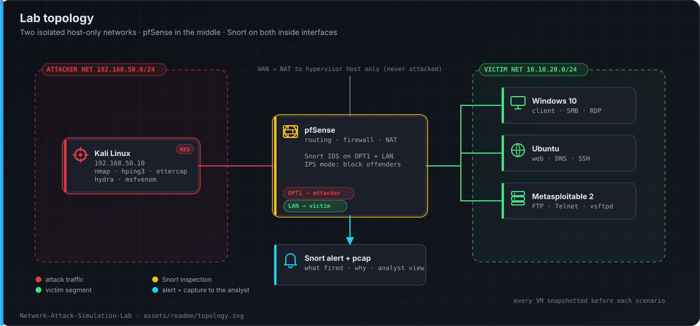

<p align="center"></p>

<p align="center">
  
  
  
  
  
</p>

A segmented network lab. Every attack is run on purpose, and every alert is explained.

pfSense sits between an attacker network and a victim network. Snort inspects both inside interfaces. Each scenario ends with the packet capture, the Snort alert, and what a network analyst should conclude.

## Topology

<p align="center"></p>

| Component | Role |
|---|---|
| pfSense | Routing, firewall rules, NAT, Snort package host |
| Snort (pfSense package) | IDS on both inside interfaces; IPS (block offenders) enabled per scenario |
| Kali Linux | Attacker — Nmap, hping3, Ettercap / arpspoof, dnsmasq, Responder, msfvenom |
| Windows 10 · Ubuntu · Metasploitable 2 | Victims and services |

## Scenarios

<p align="center"></p>

| # | Scenario | Tool | ATT&CK | Snort sees | Firewall shows |
|---|---|---|---|---|---|
| 1 | Recon — SYN, UDP, version scan | `nmap` | T1046 | ET SCAN signatures, portscan preprocessor | Burst of denied states |
| 2 | SYN flood on web server | `hping3 -S --flood` | T1499.001 | Rate-based DoS rule | State table growth |
| 3 | ICMP / UDP flood | `hping3`, `nping` | T1498.001 | ICMP flood signatures | Rate limit + block |
| 4 | ARP spoofing / MITM | `arpspoof`, `ettercap` | T1557.002 | ARP anomalies, duplicate IP→MAC | Gratuitous ARP in pcap |
| 5 | DNS spoofing / rogue DNS | `ettercap dns_spoof`, `dnsmasq` | T1557 · T1071.004 | Unexpected resolver | Clients using wrong resolver |
| 6 | DNS tunnelling | `iodine`, `dnscat2` | T1071.004 · T1048.003 | Long TXT / NULL queries | High DNS volume per host |
| 7 | Malware C2 beacon | `msfvenom` + handler | T1071.001 · T1571 | ET MALWARE / Metasploit rules | Periodic outbound on odd ports |
| 8 | Brute force (SSH / FTP) | `hydra` | T1110 | Brute-force policy rules | Repeated connections, IPS block |

Each scenario in [`scenarios/README.md`](scenarios/README.md): objective · command · Snort alert · pfSense view · analyst conclusion · false positives · rule tuning.

## Custom Snort rules (excerpt)

```
# SYN flood — more than 100 SYNs to one host in 10s
alert tcp any any -> $HOME_NET any (msg:"LAB DOS SYN flood"; flags:S; threshold:type both, track by_dst, count 100, seconds 10; classtype:attempted-dos; sid:1000001; rev:1;)

# DNS tunnelling — oversized TXT query
alert udp $HOME_NET any -> any 53 (msg:"LAB DNS possible tunnelling - long TXT query"; content:"|00 10 00 01|"; dsize:>150; classtype:policy-violation; sid:1000002; rev:1;)

# Metasploit reverse TCP default handler port
alert tcp $HOME_NET any -> $EXTERNAL_NET 4444 (msg:"LAB MALWARE outbound to 4444 - possible reverse shell"; flags:S; classtype:trojan-activity; sid:1000003; rev:1;)
```

## Repository layout

```
.
├── README.md
├── assets/readme/          # diagrams used on this page
├── docs/build-guide.md     # pfSense interfaces, rules, NAT, Snort setup, IPS mode, lab safety
├── scenarios/README.md     # the 8 scenarios: command, alert, firewall view, conclusion
└── snort/
    ├── custom.rules        # local rules (SID 1000001+)
    └── suppress.conf       # documented suppressions
```

## Lab safety

Attacks stay on isolated host-only networks. WAN is NAT to the hypervisor host only and is never attacked. Every VM is snapshotted before each scenario.

## Author

**Ebrahim Mohamed** — SOC Analyst · Detection Engineer · Cybersecurity Instructor
[LinkedIn](https://linkedin.com/in/EbrahimMohamed) · [GitHub](https://github.com/Ebrahim-Qareen)
