<p align="center"></p>

<p align="center">
  
</p>
<p align="center">
  
  
  
  
  
</p>

Every attack is run on purpose. Every alert is explained: the capture, the Snort rule that fired, and what the analyst should conclude.

## Topology

<p align="center"></p>

## Scenarios

<p align="center"></p>

Each scenario in [`scenarios/README.md`](scenarios/README.md): objective · command · Snort alert · pfSense view · analyst conclusion · false positives · tuning.

## Build it yourself

<p align="center"></p>

| Step | Do this | Where |
|---|---|---|
| 1 | Create two host-only networks: `192.168.50.0/24` (attacker), `10.10.20.0/24` (victim) | [`docs/build-guide.md`](docs/build-guide.md) |
| 2 | Install pfSense with 3 NICs: WAN (NAT to host), LAN (victim), OPT1 (attacker) | pfSense |
| 3 | Add a firewall rule OPT1 → LAN so attacks can reach the victims | pfSense |
| 4 | Install the Snort package, enable it on LAN and OPT1, turn on IPS per scenario | Snort |
| 5 | Load [`snort/custom.rules`](snort/custom.rules) and [`snort/suppress.conf`](snort/suppress.conf) | Snort |
| 6 | Build Kali (attacker), Windows 10, Ubuntu, Metasploitable 2 (victims) | Topology above |
| 7 | Snapshot every VM | Reset between scenarios |
| 8 | Run scenario 1 (`nmap` from Kali), read the alert and the pcap | [`scenarios/README.md`](scenarios/README.md) §1 |

## Custom rules (excerpt)

```
# SYN flood — more than 100 SYNs to one host in 10s
alert tcp any any -> $HOME_NET any (msg:"LAB DOS SYN flood"; flags:S; threshold:type both, track by_dst, count 100, seconds 10; classtype:attempted-dos; sid:1000001; rev:1;)

# DNS tunnelling — oversized TXT query
alert udp $HOME_NET any -> any 53 (msg:"LAB DNS possible tunnelling - long TXT query"; content:"|00 10 00 01|"; dsize:>150; classtype:policy-violation; sid:1000002; rev:1;)
```

Attacks stay on host-only networks. WAN is never attacked. Snapshot before every scenario.

**Ebrahim Mohamed** — SOC Analyst · Detection Engineer · Cybersecurity Instructor · [LinkedIn](https://linkedin.com/in/EbrahimMohamed)
